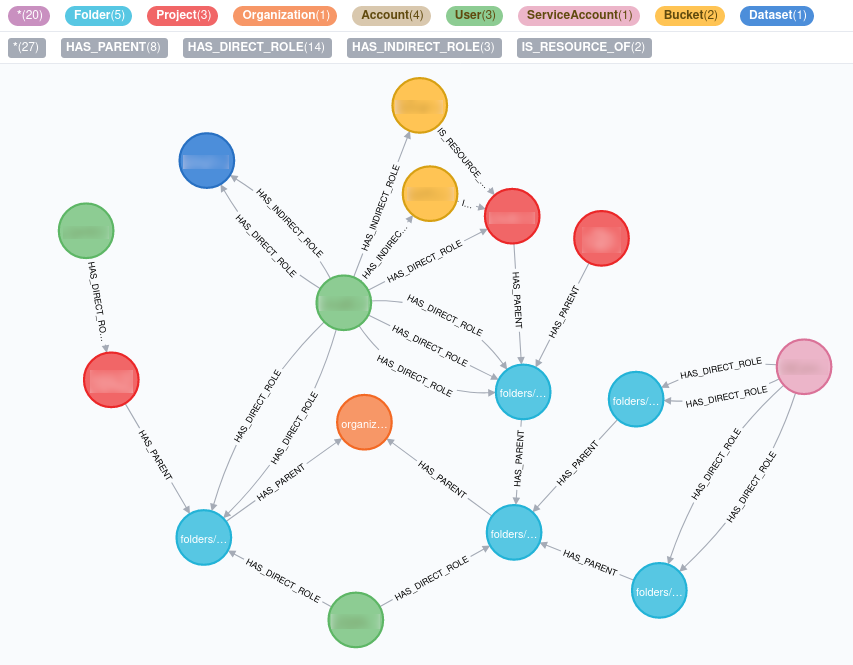

# Introduction


Use Neo4j to help visualize, explore and analyze GCP resources and IAM across your organization.



Resources are retrieved using [Cloud Asset Inventory](https://cloud.google.com/asset-inventory). This tool aims to convert resources to an easy-to-browse graph in Neo4j.

## What issues does it solve?

If you are a GCP admin in charge of an organization, you might sometimes find it difficult to navigate through your organization resources and IAM. The Google Cloud Console is the best solution to easily explore your organization, but the Web UI is limited to text output.

From the Google Cloud Console, it is easy to find who have access to a specific resource (folder, project, bucket, dataset, ...), but finding **what** specific resources a user can access is not possible out-of-the-box. You need to browse each project/resource to find IAM bindings related to this user. Obviously, you can script it, but it requires some work to completely cover inherited permissions, hidden permissions (for example, by default, did you know that all editors of a project had a `roles/storage.legacyBucketOwner` on every bucket of this project?). Representing the IAM as relationships between accounts and resources helps to find **what resources can access a user in a very simple query** :

```
MATCH (a: Account{email: "some-user@some-organization.com"})-[r: HAS_DIRECT_ROLE]->(resource)
RETURN a, r, resource;
```

This tool also allows to perform more complex queries (see "Example queries") to **help analyze your resources**.

Finally, representing resources as a graph **makes the exploration of your GCP resources easier**.

## Features

This tool aims to :

- represent the following resources as a graph (retrieved from **[Cloud Asset Inventory](https://cloud.google.com/asset-inventory)**) :
    - `cloudresourcemanager.googleapis.com/Organization`
    - `cloudresourcemanager.googleapis.com/Folder`
    - `cloudresourcemanager.googleapis.com/Project`
    - `storage.googleapis.com/Bucket`
    - `bigquery.googleapis.com/Dataset`
    - `iam.googleapis.com/ServiceAccount`
    - `iam.googleapis.com/Role`
- **easily visualize** relationships between resources
- find at a glance **what resources a user or service account can access**
- run **complex analysis** (for example : find unnecessary IAM bindings) with a simple query language ([Cypher](https://neo4j.com/docs/cypher-manual/3.5/))
- retrieve the state of your resources at **any time in the past**

The list of resources can be enriched. [Cloud Asset support many asset types](https://cloud.google.com/asset-inventory/docs/supported-asset-types). Pull requests to add IAM bindings on other resources (not listed before) are welcomed.

# How to use

This is experimental work and is in progress, so it may not work as expected. If you find any problem, feel free to create an issue or a pull request if you have enough time/knowledge to fix it!

## Prerequisites

### Tools

- `sh`
- Google Cloud SDK (`gcloud`)
- `bq`
- `docker`

Be sure that your tools are up-to-date.

### GCP resources

- a GCP project (`<project>`). Following APIs need to be enabled :
    - BigQuery API : `gcloud --project <project> services enable bigquery.googleapis.com`
    - Cloud Asset API : `gcloud --project <project> services enable cloudasset.googleapis.com`
- a BigQuery dataset in this project (`<project>:<dataset>`). Since we're using [Cloud Asset BigQuery export](https://cloud.google.com/asset-inventory/docs/exporting-to-bigquery), results should be stored somewhere!

### Permissions

The user (your own user or a service account) running this tool should have the following IAM roles :

- `roles/cloudasset.viewer` on the **organization** you want to scan (`<organization_id>`)
- `roles/bigquery.jobUser` on the GCP project previously mentioned (`<project>`)
- `roles/bigquery.dataEditor` on the Cloud Asset export dataset (`<project>:<dataset>`)

## Run

Once prerequisites are met, just run :

```
./gcp_resources_neo4j.sh <organization_id> <YYYY-mm-ddTHH:mm:ssZ> <project> <dataset>
```

to create a graph of resources at the specific time `<YYYY-mm-ddTHH:mm:ssZ>` (must be of course in the past).

Script execution time depends on the number of resources and number of relationships. On medium-sized organizations, it should not take more than 3 minutes.

At the end of the execution, a Docker container will all your resources in Neo4j will be automatically started.
You can access it via Neo4j browser (`http://localhost:7474`). Just play with your resources to discover the nodes and relationships, or read the Graph model section of this document to be guided.

# Architecture

Basically, the script goes through the following steps :

1. export specific assets to BigQuery (using Cloud Asset) : see `assets_to_bq.sh`
2. generate CSV files from SQL queries (located in `queries/`) on BigQuery export : see `bq_to_csv.sh`. Using CSV files allows to easily load resources into Neo4j (next step). After the CSV generation, tables in BigQuery are removed
3. load CSV files into Neo4j using Cypher queries (`cypher-import-scripts/`) : see `csv_to_neo4j.sh`. Load is done into a build container. At the end, the image is tagged and run locally so that you can access it via Neo4j browser (http://localhost:7474)

## A note (**important**) on security

Anyone that can access the final container or the BigQuery dataset (even if it's removed at the end of the script) can view all resources of an organization. All these resources can be critical, so please control who can access those artifacts. This is also available if you decide to run the script in a Compute Engine instance and expose the port 7474 to the whole world to access Neo4j browser. Authentication to Neo4j is very simple (`neo4j/password`, this can be set in the `Dockerfile`, but it's still basic authentication). Thus, don't rely on this to protect your data. Securing access to your assets is the responsibility of the user of the application, not of this tool.

## Graph model

Every graph is composed of **nodes** and **relationships** between nodes.

### Nodes

Nodes represent resources.

#### Accounts

Nodes representing accounts can be represented with the following hierarchy :

```
                           +---------+
                           | Account |
                           +----^----+
                                |
                                |
             +----------------------+--------------+
             |                      |              |
             |                      |              |
     +-------+--------+         +---+---+      +---+--+
     | ServiceAccount |         | Group |      | User |
     +-------^--------+         +---^---+      +------+
             |                      |
             |                      |
+------------+------------+  +------+-------+
| UnmanagedServiceAccount |  | SpecialGroup |
+-------------------------+  +--------------+
```

- `Account` is a generic node including all kinds of accounts
- `ServiceAccount` represents a service account
- `Group` represents a Google group
- `SpecialGroup` is a particular kind of group. It corresponds to `allUsers` and `allAuthenticatedUsers`. These are not Google groups strictly speaking but they still are groups because it represents a group of users
- `User` represents a single user
- `UnmanagedServiceAccount` is a particular kind of `ServiceAccount`. It represents service accounts that do not belong to any GCP project under the organization (it could be Google system service accounts, service accounts from other organizations, or service accounts belonging to deleted projects but still having permissions on some resources). It appears here because these `UnmanagedServiceAccount`s have permissions on resources of your organization. Note that it may simply be some resources not included in the graph.

**Properties** :

- any `Account` node have an `email` field
- any `ServiceAccount` node (excluding `UnmanagedServiceAccount`) have an `id` and a `displayName`

#### Hierarchical resources

To represent GCP project hierarchy, there are 3 kind of nodes :

- `Organization`. Properties are `creationTime`, `displayName`, `id` (numeric), `name` (`organizations/<id>`) and `ownerDirectoryCustomerId`
- `Folder`. Properties are `displayName`, `id` (numeric) and `name` (`folders/<id>`)
- `Project`. Properties are `createTime`, `id` (project id), `name`, `projectNumber` (numeric)

Hierarchy is represented with relationships (`[:HAS_PARENT]`).

#### Other resources

Other resources are :

- `Bucket`. Properties are `bucketPolicyOnlyLocked`, `id` (bucket name), `location`, `storageClass` and `timeCreated`
- `Dataset`. Properties are `datasetId`, `id` (`projectId:datasetId`) and `location`

### Relationships

Nodes are bound with different relationships.

#### Hierarchical relationships

- `(:User) -[:IS_MEMBER_OF]-> (:Group)`. An user can belong to one or more Google group. This relationship is present only if the `results/mapping_groups.csv` file is correctly filled. You can fill it manually or if you are using GSuite, create a small script to retrieve all groups and users (see also `results/README.md`)
- `(:Folder | :Project) -[:HAS_PARENT]-> (:Organization | :Folder | :Project)`. A folder or project have at least one parent
- `(:Bucket | :Dataset) -[:IS_RESOURCE_OF]-> (:Project)`

These relationships do not have properties.

#### IAM

- `(:Account) -[:HAS_DIRECT_ROLE | :HAS_INDIRECT_ROLE]-> (:Organization | :Folder | :Project | :Bucket | :Dataset)`

**Properties** :

- `role`
- `permissions`
- `type`

**What is `[:HAS_INDIRECT_ROLE]`?**

`[:HAS_DIRECT_ROLE]` represents direct IAM binding, while `[:HAS_INDIRECT_ROLE]` is reserved for IAM on other resources (buckets, datasets, ...) with some specificities. For example, by default, all users having `roles/editor` on a project belongs to a special group (`projectEditors`), who have write access to all buckets in this project. `[:HAS_INDIRECT_ROLE]` have been created to differentiate these specificities.

# Examples queries

`cypher-examples/` folder contains examples of Cypher queries you can run to explore your data. You can
run them from Neo4j browser (`localhost:7474`) or directly with `cypher-shell` :

```
sudo docker exec -it neo4jresources cypher-shell
```

And authenticate (`neo4j/password`).
